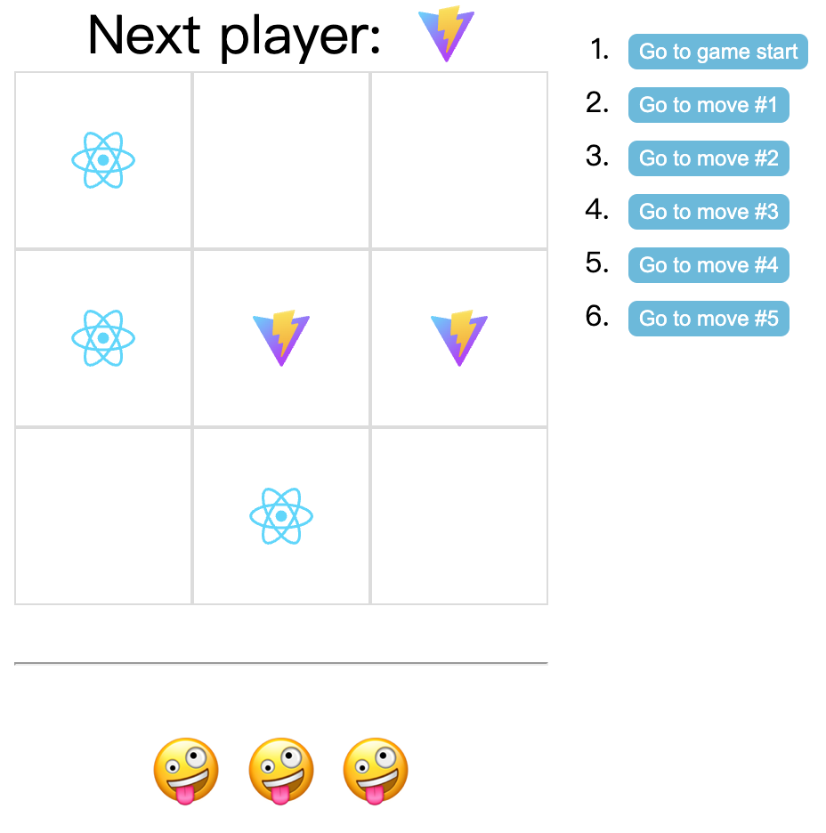
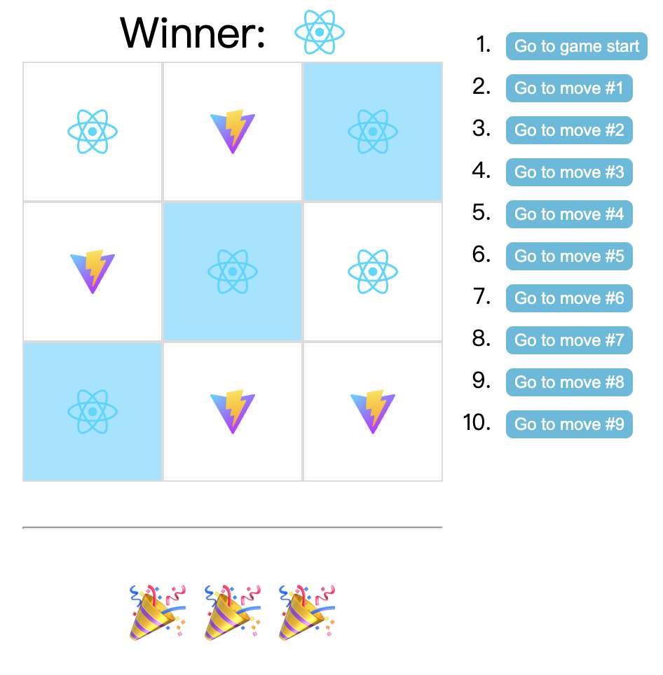
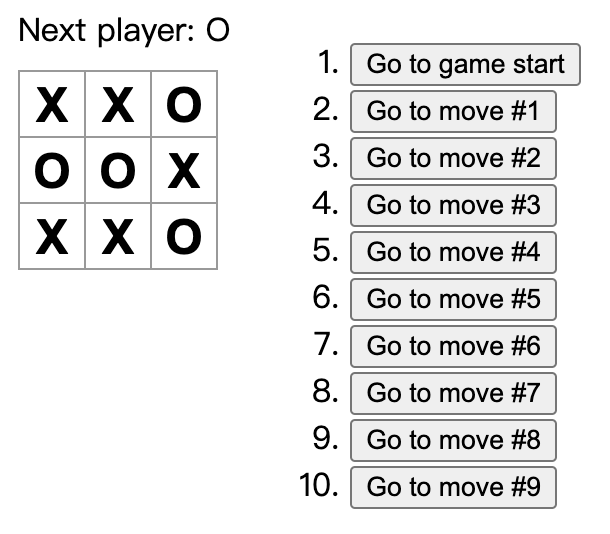
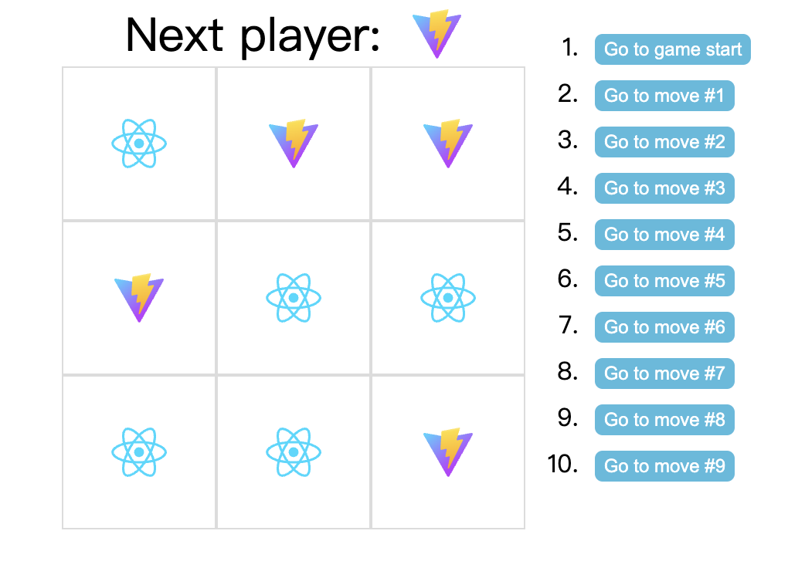

# Tic-Tac-Toe Game (React Tutorial)





## Introduce

I learnt a little HTML, CSS and JavaScript when I was trying to follow the tutorial of the tic-tac-toe game that came from React official team.

By following the steps of the official tutorial, you can get a tic-tac-toe game there. I was following most steps of the official tutorial with some different changes in my code. When I was trying to make some changes I got so many bugs in it. And I will show you some of them.

---

## Main Steps

### Start

Tool: Vite

> Vite (French word for "quick", pronounced `/vit/`, like "veet") is a build tool that aims to provide a faster and leaner development experience for modern web projects.
>
> *source: https://vitejs.dev/guide/*

I started with NPM:

```shell
$ npm create vite@latest
```

after that, I get a Template project folder of React, then install the packages which are needed by the project:

```shell
$ npm install
```

run: 

```shell
$ npm run dev
```

### Follow the tutorial

> You will build a small tic-tac-toe game during this tutorial. This tutorial does not assume any existing React knowledge. The techniques you’ll learn in the tutorial are fundamental to building any React app, and fully understanding it will give you a deep understanding of React.
>
> *source: https://react.dev/learn/tutorial-tic-tac-toe*

---

## Changes

## reverse 'X' and 'O' to react.svg file  and vite.svg file

The changes make the final work more interesting, which looks.





---

## Notes

### Use sources in /public and /src/assets

> There are two ways you can place your assets inside the project.
>
> 1. **Inside public Folder📂**
> 2. **Inside src Folder📂**
>
> <u>**Inside Public Folder:**</u>
>
> If you **put a file into the public folder, it will not be processed by Webpack.** Instead **it will be copied** into the build folder untouched.To reference the assets in public folder, you need to use a special variable called **PUBLIC_URL**. Only files inside the public folder will be accessible by
>
> **Syntax:**
>
> ```javascript
> %PUBLIC_URL%
> <link rel="shortcut icon"  href="%PUBLIC_URL%/favicon.ico>
> 
> ```
>
> **Generally, it is recommended to import images and fonts from JS.**
>
> **<u>Inside src Folder:</u>**
>
> You can import a file right into the js module. This tells webpack to include that file in the bundle.
>
> - Scripts stylesheet **gets minified and bundled together** to **avoid extra network requests.**
> - **Missing fields cause compilation errors instead of 404 errors for users.**
> - **Result filenames include content hashes** so you don’t need to worry about browsers caching their old versions.
>
> **How to use:📝**
>
> ```javascript
> App.js
> import pic from './pic.jpg'
> 
> ```
>
> This ensures that when the project is built. **Webpack will correctly move the images into the build folder and provide us with the correct path.**
>
> *source: https://medium.com/@aman_adastra/day-21-of-50-days-of-react-how-to-use-image-and-assets-in-react-ef4d0c54ded7*

/public

```javascript
const viteIconImg = '';
```

/src/assets

```javascript
import reactIcon from '../assets/react.svg'

const reactIconImg = ``;
```

### Re-rendering Components in ReactJS

> As we know React JS is an open source JavaScript library that is used for building user interfaces specifically for single-page applications. It is also known for providing fast user experience by only updating the parts of the UI that have changed. Rendering components is not in user hands, it is a part of React Component Lifecycle and is called by React at various app stages, generally when the React Component is first instantiated. A second or subsequent render to update the state is called as **re-rendering**. **<u>*React components automatically re-render whenever there is a change in their state or props.*</u>**
>
> **<u>*A simple update of the state, from anywhere in the code, causes all the User Interface (UI) elements to be re-rendered automatically.*</u>** However, there may be cases where the render() method depends on some other data. Re-render can be caused due to any of the three reasons listed:
>
> 1. Update in State
> 2. Update in prop
> 3. Re-rendering of the parent component
>
> *source: https://www.geeksforgeeks.org/re-rendering-components-in-reactjs/*

Doing task:

> When someone wins, highlight the three squares that caused the win (and when no one wins, display a message about the result being a draw).

1. Define an array of variable lights which is internal variable and mark the square which needs to be lighted on.
2. When someone wins, make these variables change to 'light' corresponding to each square.
3. Enable the CSS selector '.light' which  makes the three squares highlight which caused the win.

